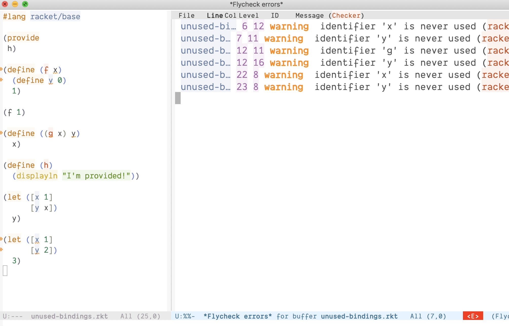

# racket-review

<p align="left">
  <a href="https://github.com/Bogdanp/racket-review/actions?query=workflow%3A%22CI%22"></a>
</p>



<p align="center">
  <strong><em>warning: experimental software ahead</em></strong>
</p>

`racket-review` performs surface-level linting of individual Racket
modules with the intent of finding issues as quickly as it can.  It
does not expand the programs it lints.

It currently reports the following issues:

* `[error]` "identifier * provided but not defined"
* `[error]` "identifier is already defined"
* `[error]` "if expressions must contain one expression for the then-branch and another for the else-branch"
* `[error]` "let forms must contain at least one body expression"
* `[error]` "syntax error"
* `[error]` "use _ instead of else in the fallthrough case of a match expression"
* `[error]` "case clause must be in the form (<const> ...), not '<const>"
* `[error]` "use '() for match pattern instead of null or empty"
* `[warning]` "bindings within a let should be surrounded by square brackets"
* `[warning]` "identifier * is already defined"
* `[warning]` "identifier * is never used"
* `[warning]` "identifier * shadows an earlier binding"
* `[warning]` "missing module (#lang) declaration"
* `[warning]` "require (for-syntax ...) should come before all others"
* `[warning]` "require * should come after *"
* `[warning]` "require * should come before *"
* `[warning]` "this cond expression does not have an else clause"
* `[warning]` "use a cond expression instead of nesting begin or let inside an if"

## Setup

    $ raco pkg install review

## Usage

    $ raco review filename.rkt

To tell the linter to ignore an entire module, add a comment like

``` racket
#|review: ignore|#
```

to the source file.

## Emacs/flycheck support

Add the following snippet to your `init.el` to define a Flycheck
checker for racket-review:

``` emacs-lisp
(flycheck-define-checker racket-review
  "check racket source code using racket-review"
  :command ("raco" "review" source)
  :error-patterns
  ((error line-start (file-name) ":" line ":" column ":error:" (message) line-end)
   (warning line-start (file-name) ":" line ":" column ":warning:" (message) line-end))
  :modes racket-mode)

(add-to-list 'flycheck-checkers 'racket-review)
```

## Prior work

* http://planet.racket-lang.org/package-source/clements/no-brainer.plt/1/5/
* http://tmp.barzilay.org/code-ayatollah.rkt
* https://github.com/jackfirth/syntax-warn
